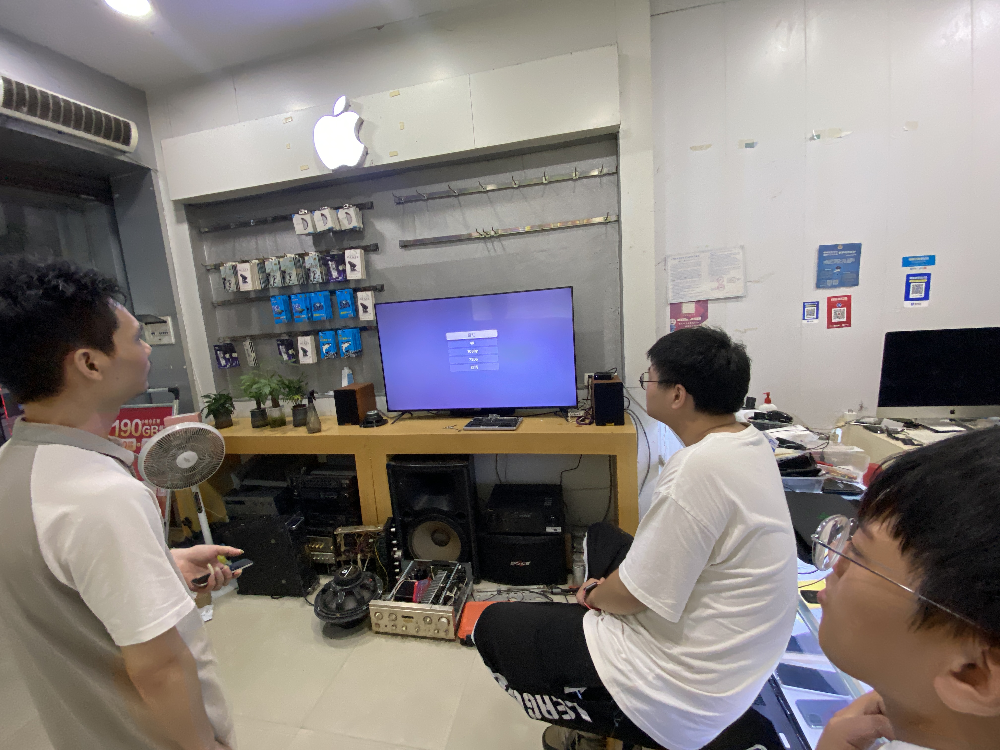
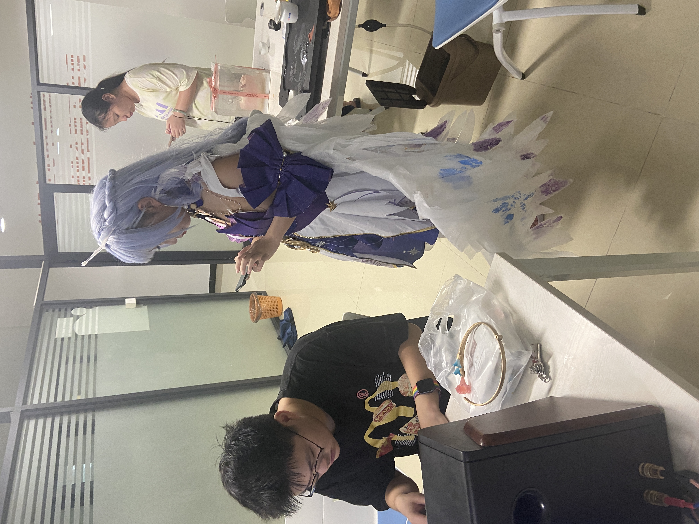
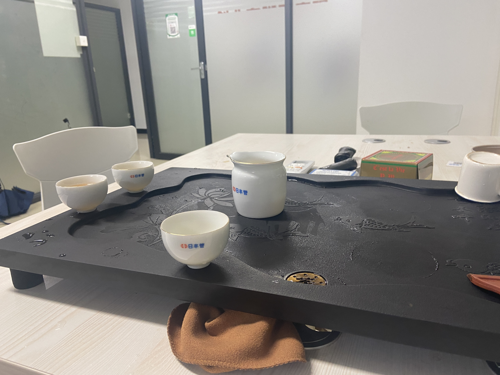

<route lang="yaml">
meta:
  layout: Markdown
</route>

# 2024 琐事

转瞬，2024 年已经过去了一半。一下子大一就过去了。从大一准备上大二，心境也有了一些变化。

互联网上的`抽象`气氛越来越重，人们对于抽象活越来越深入，对于`具体的事物`估计越来越陌生。这种现象越来越多，最具体的，能表现在小孩身上——现在的10后，从小玩抽象，哪怕我是个05年的，也能感受到和10后之间究竟有多深的鸿沟。时代发展的太快太快了，人们的认知也在不断的变化。

## 计算机人

现今的计算机专业，怕是大抵有`两种人`：

一种是怨气是非常之重的，这种人占了大多数，有会`向外吐出自己的不快的`（例如我）也有`闷骚`的，但是无论怎么样的性格，实际上都是感到对未来的`恐惧` `焦虑` `压力大`的人。

技术这种东西，入门很难，但是入了门之后，很容易就豁然开朗。因此，分为两种人来讲，

- 有技术的人，在劝退没技术的人`不要去学技术`，没啥吊用，就业越来越难/去考公考编比学技术强多了/学技术的人都是`傻子`，实际上又是有两种心态：
  - 一方面是计算机真人满为患了，不想再有更多人再进这个圈子来卷自己。
  - 另一方面，也确实是实话，计算机确实很难，不是所有人都适合去卷的。
- 没技术的人，大多是对未来`迷茫`，不知道未来出来社会了自己到底干啥好。是进计算机行业/考研/考公/考编/考研/考博/还是tmd回家种田？对自己的未来没个底。

一种是精神状态`看似`非常好的：即外表给人的感觉非常的`正能量`，但是内心其实也有很深的雾霾；用大白话讲其实就是`非常非常的闷骚`乃至到隐藏自己隐藏到非常的深的，`闷骚天王级别`而心情还是保留`对未来的希望`的人。但是这种人非常的少，但是我身边确实有，一个班40～50人左右，能有一两个这样的人都非常的不错了。

他们在行动上，为了某些目的非常的`上进` `勤奋`，但是我总感觉他们坚持不了多久，好像是在疯狂的`燃烧自己`，疯狂内卷，疯狂的`自我否定`，疯狂的`自我压迫`，疯狂的`自我折磨`，疯狂的`自我消耗`，也不知道是不是疯狂的`自我毁灭`。

## 网络上

B站越来越不行之后，我刷知乎/掘金/贴吧等平台的时间比刷B站越来越多。

特别是之后，深感人与人之间的阶级鸿沟，太难跨越了。半夜看着B乎上一堆大佬，越看越觉得自己很渺小。越感觉自己就是个废物，学了那没吊用的前后端，考了个臭专科，纱布计算机专业，数学成绩又不好，不敢专升本，高数一窍不通。

感觉我这人啊，就是小县城的命。

越看知乎越能看到离知乎这些大佬的距离，到底是有多远。什么人才都有，什么鬼才都有，人人都牛掰，个个大城市IP，个个高谈阔论，引经据典，饱腹经书，在这个平台上我越发感觉一个屁都不敢放。

只好在这里发牢骚抱怨了。反正知乎最缺的是我们这些底层人民的烟火气，那我让我来加一点吧。想着，哎，既然这样，那就接受事实吧，卡在钻石段位了，这辈子怕难上去了。

养老。小县城的命，而小县城的人们，充满了烟火气，养老、养生，是大伙最看重的话题——大家似乎又在外头抽大烟喝大酒，实际上好多人背地里一直嫌弃那些天天抽大烟喝大酒的——都在偷偷养生：特别是中药，拿我爸妈举例，天天煲中药汤剂，不知道是什么秘方，天天喊着：

> “吃了除湿气喔。”

> “这个吃了很补的喔，多吃点。”

我们这种NPC，能从这些小事情里汲取得到些许的快乐，就已经感到很幸福了。

我爸不抽烟不喝酒。供我上这个破大专，就是为了圆我爸的梦想：“爸没有上过大学，无论怎么样，你考到多少分，你爸都会供你上大学的！”

但是我能看得出来我爸在背后付出了多少力。

我爸妈都是在水泥厂余热发电/仓库的工人，这些年我爸也是兢兢业业，勉强混到了一个小领导的位置，家里全靠他——全家的顶梁柱。破民办大专，对于他来说，我也不知道压力对他大不大，只是觉得这个钱花的太不值得了。

——唉，一学年2万多块钱。

这真的是一个天价，我感觉我真的对不起我爸妈。学习不好，氛围不好，什么都不好，没心思学习，越到高三越没有心思学习，我真的不知道怎么面对他们。

我走春招的，高考实在是没法考。春招之后，我爸还是似乎很坦然地接受了。他很坦然，他真的很坦然。

我也不知道他哪里来的这个心情。

> “2万也没办法，难不成你在家上三年家里蹲大学咩？人只有接受现实，不能逃避现实。”

他是这么说的。但是我心里还是很苦涩，对不起父母，真的对不起父母，太贵了。

上了大学之后，到处省钱，为了这个家。现在我不是家里的顶梁柱，但是专升本太难，很怕很快出来社会真成顶梁柱。

于是疯狂赚钱，靠稳定来源赚钱，成为我的首步——但是我对自己也有个清楚的认知：我是一个内向的人，你要我大一就出去找兼职对我来说又是一个天灾地狱。

## 创业园

于是便又在学校内捞人脉：宿舍有个大佬之前做过电脑维修，2024年，大一下学期，在校内开个创业园，修手机电脑，他就是店长了。

那就干一票他娘的。现在一学期下来，虽然单很多，很累，但是发现赚到的钱还是太少了，而限制又是如此之多，学校要求你营业时间必须人在那里，没人会撤掉你这个项目。

`太难了`。虽然说一整个学校只有我们是修手机的——连商业街啊都没有手机维修电脑维修，相当于我们垄断了整个学校，但是依旧没有任何出路，到现在融资的钱都才刚赚回来。

我们的创业园在004号，004号在创业园的非常里面，不显眼，一开头真害怕没流量，还做了一个广告牌搬到创业园大门门口。

据店长说，以前这个004号也是一个修手机电脑的，叫`师兄通讯`，但是现在他们都毕业了，所以就关门了。也是因为这个原因，哪怕004很偏僻，但是也赚来一些自然流量，但是还是太少了。有时候，一连守店守了两天都没有一个客上门。

这是在我们对接的上家店里拍的，pang b这个音响是真的够劲，加上Apple TV 4K，画质也是真的好，太爽了。

一个coser来修手机，旁边黑衣服的就是店长。

天天不是在这泡茶就是在打杂，没客的时候真无聊的要命，除了泡茶都不知道干啥好；有客的时候又忙的要死，真是矛盾。

> 未完待续
